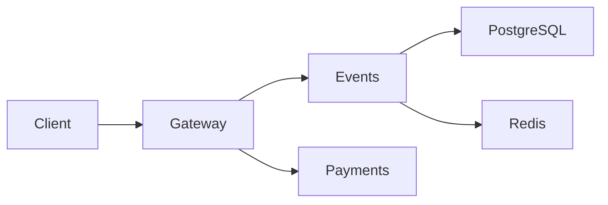

# Lab 1 - SRE Philosophy: Deploy, Break, Understand

## Task 1 - Deploy and Break QuickTicket

### Deployment

I started the QuickTicket stack with Docker Compose and checked the container state before running any failure tests.

```bash
sudo docker compose up --build -d
sudo docker compose ps
```

Observed state:

```text
NAME             SERVICE    STATUS
app-events-1     events     Up
app-gateway-1    gateway    Up
app-payments-1   payments   Up
app-postgres-1   postgres   Up (healthy)
app-redis-1      redis      Up (healthy)
```

All five required services were running. PostgreSQL and Redis also reported a healthy status.

---

### Normal system behavior

I first checked the system while all dependencies were available.

The health endpoint returned:

```json
{
  "status": "healthy",
  "checks": {
    "events": "ok",
    "payments": "ok",
    "circuit_payments": "CLOSED"
  }
}
```

I then tested the complete user flow: read the event list, reserve one ticket, and pay for it.

The reservation request returned:

```json
{
  "reservation_id": "bd564b10-710e-48d5-bd91-e978f752b96d",
  "event_id": 1,
  "quantity": 1,
  "total_cents": 5000,
  "expires_in_seconds": 300
}
```

I used the returned reservation ID for the payment request.

```json
{
  "order_id": "bd564b10-710e-48d5-bd91-e978f752b96d",
  "event_id": 1,
  "quantity": 1,
  "total_cents": 5000,
  "status": "confirmed"
}
```

This confirmed that the full critical path worked correctly before fault injection.

---

### Dependency map



From the failure tests, I found that the gateway depends directly on both application services. The events service itself depends on PostgreSQL for persistent data and Redis for temporary reservation state.

The payment path is slightly wider than it first looks: even when the payment service accepts a payment, the workflow can still fail later if the events service cannot confirm the reservation.

---

### Failure exploration

I stopped one component at a time and repeated the same API checks.

| Component stopped | Event list | Reserve | Pay | Health endpoint | What I observed |
|---|---:|---:|---:|---:|---|
| `payments` | 200 | 200 | 504 | 503 | Browsing and reservation still worked, but checkout timed out. |
| `events` | 504 | 504 | 500 | 503 | Most user actions failed because the gateway could not reach the events service. |
| `redis` | 200 | 504 | 500 | 503 | Event reads still worked, but reservation state could not be handled correctly. |
| `postgres` | 502 | 500 | 500 | 503 | Persistent event data became unavailable and the events path broke. |

#### Payments failure

I stopped the `payments` container and tested the application again.

The event list still returned HTTP 200, and I was also able to create a new reservation with HTTP 200.

Trying to pay returned:

```json
{
  "detail": "Payment service timeout"
}
```

with HTTP 504.

The health endpoint changed to:

```json
{
  "status": "degraded",
  "checks": {
    "events": "ok",
    "payments": "down",
    "circuit_payments": "CLOSED"
  }
}
```

and returned HTTP 503.

I concluded that the payments service has a limited blast radius: it blocks checkout, but does not prevent users from viewing events or creating reservations.

#### Events failure

I stopped the `events` service next.

Both listing events and creating reservations returned HTTP 504 with:

```json
{
  "detail": "Events service timeout"
}
```

A payment attempt returned HTTP 500:

```json
{
  "detail": "Payment succeeded but confirmation failed - contact support"
}
```

The health endpoint reported the events dependency as down.

This was the widest application-level failure because event browsing, reservation creation, and post-payment confirmation all depend on this service.

#### Redis failure

When I stopped Redis, the event list still returned HTTP 200.

However, creating a reservation returned HTTP 504, and paying for a reservation returned HTTP 500 because the application could no longer complete confirmation correctly.

The health endpoint returned HTTP 503 and marked the events path as down.

This showed that Redis is not needed for basic event reads, but it is required for temporary reservation state.

#### PostgreSQL failure

Finally, I stopped PostgreSQL.

The event list failed with HTTP 502:

```json
{
  "detail": "Events service unavailable"
}
```

The reservation request returned HTTP 500, and the payment flow also ended with HTTP 500 during confirmation.

The health endpoint returned HTTP 503 and marked the events dependency as down.

This showed that PostgreSQL is a critical dependency for the events service because event data and reservation-related operations depend on persistent storage.

---

### Recovery check

After starting all stopped dependencies again, I verified the system one more time.

The final health response returned:

```json
{
  "status": "healthy",
  "checks": {
    "events": "ok",
    "payments": "ok",
    "circuit_payments": "CLOSED"
  }
}
```

So the system recovered after all injected failures were removed.

---

### Load test

I ran the load generator at 10 requests per second for 30 seconds with all services available.

```text
QuickTicket Load Generator
Target: http://localhost:3080 | RPS: 10 | Duration: 30s

Done. total=207 success=207 fail=0 error_rate=0%
```

The healthy run completed without failed requests.

I then ran a second test at 5 requests per second and stopped `payments` while the test was still running.

```text
QuickTicket Load Generator
Target: http://localhost:3080 | RPS: 5 | Duration: 30s

[10s] requests=42 success=42 fail=0 error_rate=0%
[10s] requests=45 success=44 fail=1 error_rate=2.2%

Done. total=62 success=59 fail=3 error_rate=4.8%
```

I saw the error rate increase only after the payments service was stopped. The final error rate was 4.8%.

The percentage stayed relatively low because not every generated request uses the checkout path. Requests that only read event data were still able to complete successfully.

---


## Task 2 - Graceful Degradation

For this task, I changed the payment error handling in `app/gateway/main.py`.

Originally, a timeout from the payments service was returned as a generic HTTP 504 error. I changed this behavior so that both connection errors and timeouts return a structured HTTP 503 response with a clear explanation for the user.

The change I made was:

```diff
-    except httpx.TimeoutException:
-        raise HTTPException(504, "Payment service timeout")
+    except (httpx.ConnectError, httpx.TimeoutException):
+        return JSONResponse(
+            status_code=503,
+            content={
+                "error": "payments_unavailable",
+                "message": "The payment service is temporarily unavailable. I kept the reservation active, so the payment can be retried later.",
+                "reservation_id": reservation_id,
+            },
+        )
```

After applying the change, I rebuilt the gateway container and created a new reservation while the system was healthy.

```json
{
  "reservation_id": "f799bc85-f7f6-4b59-ba48-6c83e84bbee8",
  "event_id": 1,
  "quantity": 1,
  "total_cents": 5000,
  "expires_in_seconds": 300
}
```

Then I stopped the payments service:

```bash
sudo docker compose stop payments
```

I verified that reservation creation still worked even while payments was unavailable.

```json
{
  "reservation_id": "c7dba448-9e90-4409-8f36-a3cdbeaf4a92",
  "event_id": 1,
  "quantity": 1,
  "total_cents": 5000,
  "expires_in_seconds": 300
}
```

The reservation endpoint returned:

```text
HTTP_STATUS=200
```

Next, I tried to pay for the reservation created before the outage.

The gateway returned:

```json
{
  "error": "payments_unavailable",
  "message": "The payment service is temporarily unavailable. I kept the reservation active, so the payment can be retried later.",
  "reservation_id": "f799bc85-f7f6-4b59-ba48-6c83e84bbee8"
}
```

with:

```text
HTTP_STATUS=503
```

I also checked the health endpoint while payments was stopped:

```json
{
  "status": "degraded",
  "checks": {
    "events": "ok",
    "payments": "down",
    "circuit_payments": "CLOSED"
  }
}
```

The health endpoint itself returned HTTP 503, which correctly reflected that one critical dependency was unavailable.

Finally, I started the payments service again and confirmed that the system returned to the healthy state:

```json
{
  "status": "healthy",
  "checks": {
    "events": "ok",
    "payments": "ok",
    "circuit_payments": "CLOSED"
  }
}
```

This change gives the client a more useful failure response than a generic timeout. The reservation can still be created while payments is down, and the user is told that payment can be retried later.

---

## Task 3 - GitHub Community

Stars are useful to me as a simple way to save repositories that I may want to return to later. They also give maintainers a visible signal that their project is being used or noticed.

Following other developers is useful in team work because it makes their public activity easier to discover. It can also help me find projects, tools, and implementation ideas that are relevant to the same technical area.

---

## Bonus Task - Resource Usage Under Load

### Idle state

I captured a resource snapshot after the services had recovered and before starting new generated traffic.

| Container | CPU | Memory | Network I/O | PIDs |
|---|---:|---:|---:|---:|
| gateway | 0.21% | 39.6 MiB | 33.9 kB / 33.4 kB | 3 |
| events | 0.29% | 41.84 MiB | 17.5 kB / 19 kB | 2 |
| redis | 0.70% | 8.152 MiB | 5.67 kB / 2.15 kB | 6 |
| payments | 0.41% | 33.76 MiB | 8.26 kB / 4.4 kB | 2 |
| postgres | 5.56% | 20.38 MiB | 2.19 kB / 1.91 kB | 7 |

The events service used the most memory in this snapshot at about 41.84 MiB.

PostgreSQL showed the largest instantaneous CPU value in the idle snapshot, but this was taken shortly after service recovery, so I treat it as a point-in-time measurement rather than a steady-state trend.

---

### Normal load

While the 10 RPS load generator was running, I captured another resource snapshot.

| Container | CPU | Memory | Network I/O | PIDs |
|---|---:|---:|---:|---:|
| gateway | 6.40% | 40.3 MiB | 161 kB / 158 kB | 3 |
| events | 3.48% | 42.38 MiB | 129 kB / 171 kB | 2 |
| redis | 4.93% | 8.555 MiB | 24.9 kB / 10.4 kB | 6 |
| payments | 0.24% | 33.66 MiB | 13.6 kB / 8.12 kB | 2 |
| postgres | 1.15% | 23.41 MiB | 59.7 kB / 66.1 kB | 8 |

Under normal load, the gateway used the most CPU at 6.40%. This makes sense because every external request enters through the gateway and it also performs calls to downstream services.

The events service remained the largest memory user at 42.38 MiB.

The normal load generator completed 207 requests with 207 successes, so the increased resource usage did not correspond to a reliability problem.

---

### Payments fault injection

For the final experiment, I restarted the payments service with a 30% configured failure rate and an additional 500 ms latency.

During this test, I captured:

| Container | CPU | Memory | Network I/O | PIDs |
|---|---:|---:|---:|---:|
| payments | 0.30% | 35.09 MiB | 3.5 kB / 2.43 kB | 2 |
| gateway | 5.44% | 40.07 MiB | 541 kB / 526 kB | 3 |
| events | 2.96% | 42.57 MiB | 454 kB / 614 kB | 2 |
| redis | 0.69% | 9.035 MiB | 73.5 kB / 30.5 kB | 6 |
| postgres | 0.47% | 23.91 MiB | 249 kB / 287 kB | 8 |

The load generator finished with:

```text
Done. total=168 success=156 fail=12 error_rate=7.1%
```

The most obvious effect of the injected faults was the reliability drop: the healthy run had a 0% error rate, while this run reached 7.1%.

I also observed much larger cumulative network I/O on the gateway and events containers than in the earlier snapshot. Gateway memory stayed close to 40 MiB, so this single measurement did not show a major memory increase from the added payment latency.

Because `docker stats --no-stream` is only a snapshot, I would not use one sample to claim that latency always lowers or increases CPU. What I can clearly show from this run is that the gateway remained the busiest application entry point and that payment faults directly increased the number of failed requests.

---

## Summary

I deployed the complete QuickTicket stack, verified the normal reservation and payment flow, and then tested the effect of losing each major dependency.

The failures were not equally severe. A payments outage mainly affected checkout, while an events outage affected almost the entire user workflow. Redis failures mainly broke reservation state, and PostgreSQL failures made the events service unable to provide persistent data.

The load tests also showed the difference between component health and whole-system availability. Even with payments unavailable, part of the traffic continued to succeed because event-reading requests do not depend on checkout.

The resource measurements showed that the gateway was the most CPU-active application service during normal traffic, while the events service consistently used the most memory.
